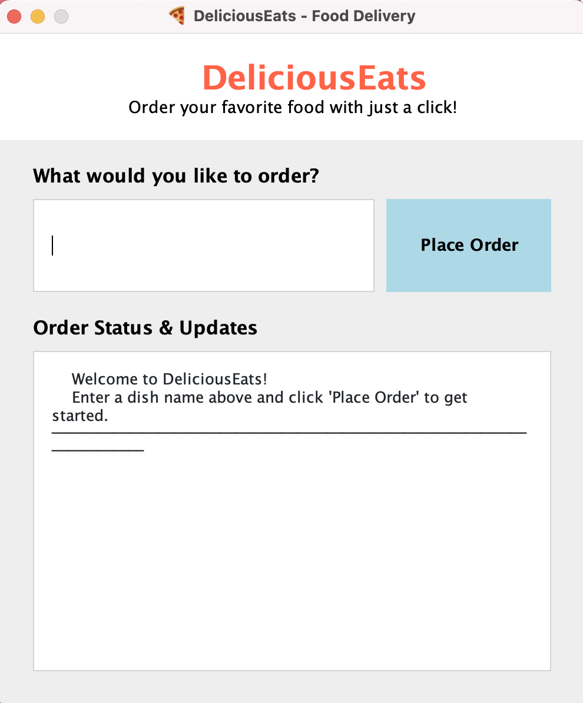
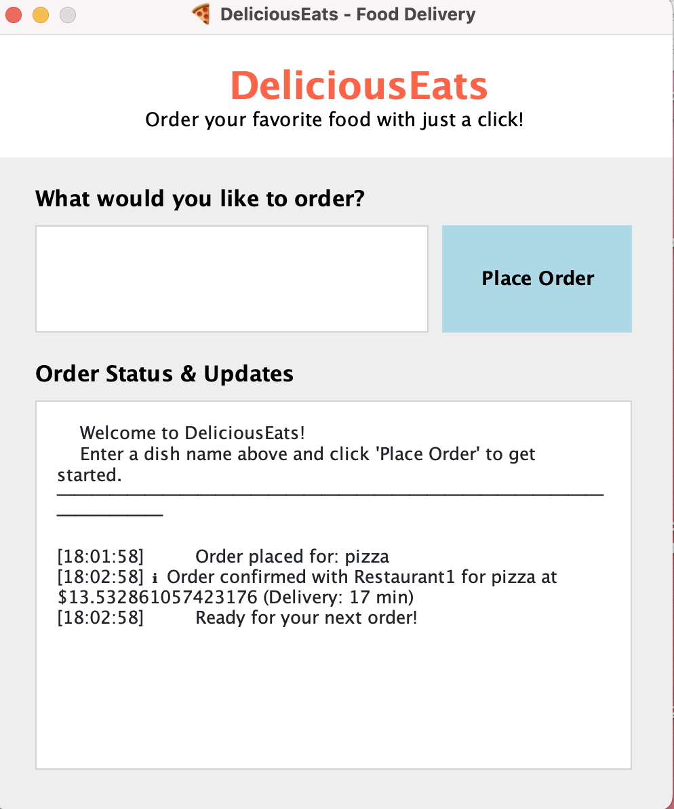

# 🍕 DeliciousEats – Plateforme de Livraison de Nourriture avec JADE

**DeliciousEats** est une application Java simulant un système de livraison de nourriture basé sur des agents intelligents, développée avec le framework **JADE (Java Agent DEvelopment Framework)**.  
Elle permet de simuler l’interaction entre un client, plusieurs restaurants, et un service de livraison, chacun représenté par un agent autonome.

---

##  Objectif du projet

Ce projet académique vise à illustrer l’utilisation des systèmes multi-agents dans un contexte pratique. Il démontre comment plusieurs agents peuvent coopérer pour gérer une commande, proposer des offres, sélectionner la meilleure, et simuler un processus de livraison complet.

---

##  Architecture multi-agents

- **ClientAgent** : Passe la commande et reçoit les propositions.
- **DeliveryAgent** : Coordonne la communication entre le client et les restaurants.
- **RestaurantAgent(s)** : Répondent aux demandes avec un prix et un délai.
- Les agents utilisent les messages ACL définis par FIPA pour communiquer.

---

##  Interface utilisateur

L’interface Swing permet de :
- Entrer un plat à commander.
- Afficher en temps réel les étapes de la commande.
- Visualiser les offres reçues et la sélection finale.

---

##  Technologies utilisées

- Java 11+
- JADE 4.6.0 (framework multi-agents)
- Swing (interface graphique)
- UML (modélisation)

---

##  Aperçu de l'application

| Écran de commande | Journal des étapes |
|-------------------|--------------------|
|  |  |

>  **Sniffer JADE** peut être utilisé pour observer les messages entre agents en temps réel.

---

##  Installation et exécution

### 1. Prérequis

- Java JDK 11 ou supérieur
- JADE 4.6.0 (à ajouter au classpath)

### 2. Cloner le projet

```bash
git clone https://github.com/votre-utilisateur/DeliciousEats.git
cd DeliciousEats
